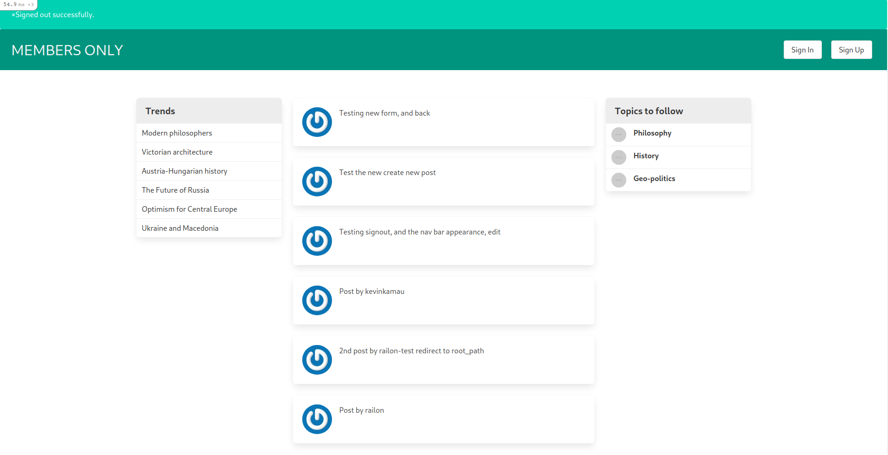

# MEMBERS ONLY

Authenticated members/users should be able to see each other's posts.
Un-authenticated users should see posts but not the authors of the posts.

### Description

“This is part of the Authentication Project in The Odin Project’s Ruby on Rails Curriculum. Find it at http://www.theodinproject.com”

## Built With

- Ruby on Rails
- Ruby
- Bulma

### Prerequisites

* Internet connection
* You need to have ruby, rails, node JS, npm and yarn installed

## Getting started

- Run this command in your OS terminal: `git clone git@github.com:kimothokamau/twitter-clone.git` to get a local copy of the project.
- Navigate to the project directory
- Run `npm install` or `yarn`
- Run `bundle install --without production`
- Run `rails db:create` and `rails db:migrate` to create a DB and migrate it to rails resepectively
- Run `rails server`
- Open the localhost https://127.0.0.1:3000/ to signup a new user
- Login using the email and password created above and make a post
- Logout and signup another different user
- Use the newly created user details to sign in and make a post
- You should now see both posts with the respective members/users who made the posts
- Logout, and you should only see the posts but not the members who made the posts as shown below:

### Project Screenshot

## Authors

👤 **Author**

- GitHub: [kimothokamau](https://github.com/kimothokamau)
- Twitter: [kimothokk](https://twitter.com/kimothokk)

## 🤝 Contributing

Contributions, issues, and feature requests are welcome!

Feel free to check the [issues page](https://github.com/kimothokamau/members-only/issues).

## Show your support

Give a ⭐️ if you like this project!

## Acknowledgments

- To developers, Microverse, ruby official guidelines and The odin Project

## 📝 License

This project is [MIT](https://es.wikipedia.org/wiki/Licencia_MIT) licensed.
